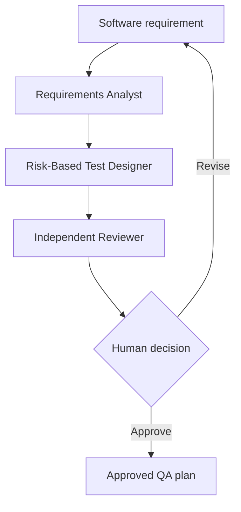

# Agentic Quality Engineering Lab

[](https://github.com/nk2136/quality-engineering-lab/actions/workflows/ci.yml)

A TypeScript portfolio project that applies AI agents to quality-engineering work without treating model output as automatically trustworthy.

## The first working system

The lab contains four specialists:

1. **Requirements Analyst** extracts business rules, risks, assumptions, and open questions.
2. **Risk-Based Test Designer** creates layered, observable test scenarios.
3. **Independent Test Reviewer** challenges coverage, assertions, test data, and maintainability.
4. **Failure Triage Agent** classifies Playwright failures using supplied evidence.

The QA-plan workflow uses code-driven orchestration so the execution order stays deterministic. Every specialist returns a Zod-validated structured output. The final artifact remains `pending` until a named human reviewer approves it.



## Why this is not just AI-generated tests

- Agents must separate evidence from assumptions.
- Outputs are validated against strict schemas.
- The reviewer is independent from the designer.
- A rejected agent review cannot be human-approved through the supplied command.
- Golden cases evaluate coverage, traceability, and review scores.
- Story Readiness evals measure decision agreement, gap recall, and citation faithfulness.
- The Jira Cloud adapter reads one exact issue key, normalizes ADF, and exposes no write operation.
- CI runs deterministic contract tests without spending API credits.
- Live LLM evals run only through a manually triggered protected environment.

## Run it

Requirements: Node.js 22 and an OpenAI API key.

```bash
npm install
export OPENAI_API_KEY="your-key"
npm run agent -- plan \
  --requirement "After five failed logins, lock the account for 15 minutes."
```

Approve a reviewed draft:

```bash
npm run approve -- artifacts/qa-plan.json \
  --reviewer "Nikesh Kunwar" \
  --notes "Validated risks, assertions, and test data."
```

Triage a Playwright JSON report:

```bash
npm run agent -- triage \
  --report path/to/playwright-report.json
```

Validate locally:

```bash
npm run check
```

Run the small live calibration corpus:

```bash
npm run eval:live
```

## Repository map

```text
src/agents.ts             specialist definitions and instructions
src/workflows.ts          deterministic multi-agent workflows
src/jira-cloud.ts         read-only Jira issue knowledge adapter
src/schemas.ts            typed output contracts
src/approve.ts            human-review gate
evals/golden-cases.json   calibration examples
evals/story-readiness-cases.json  Story Readiness human-verdict corpus
evals/run-live-evals.ts   repeatable behavioral checks
tests/schemas.test.ts     deterministic contract tests
```

## Roadmap

- Add a Playwright test-code generator behind explicit human approval.
- Ingest traces, screenshots, console logs, and network failures through MCP.
- Add a flaky-test analyzer using repeated-run history.
- Add prompt and model comparison reports to the eval corpus.
- Add a release-gate agent that produces evidence but never makes the release decision alone.

## Design basis

OpenAI recommends the Agents SDK when specialists need different instructions or policies and the SDK should manage the agent loop. The platform's evaluation guidance recommends starting with traces, then moving to datasets and repeatable eval runs once good behavior is defined.

- [OpenAI Agents SDK guide](https://developers.openai.com/api/docs/guides/agents)
- [OpenAI agent evaluation guide](https://developers.openai.com/api/docs/guides/agent-evals)

## Author

Nikesh Kunwar, Senior SDET and Quality Automation Lead focused on Playwright, TypeScript, API testing, CI/CD, and agentic quality engineering.
