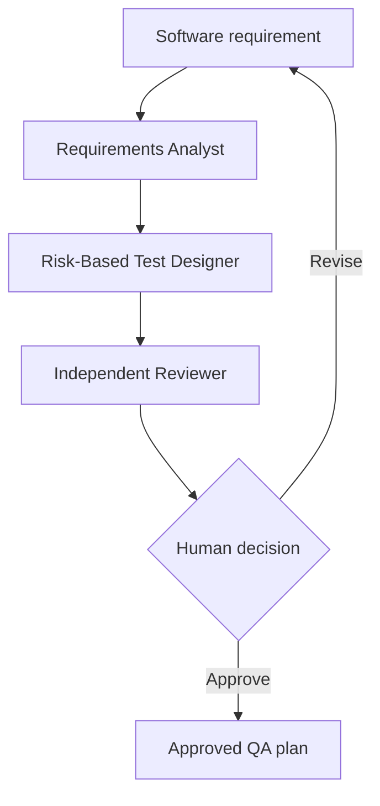
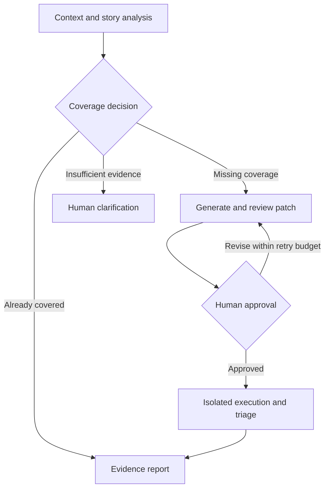

# Agentic Quality Engineering Lab

[](https://github.com/nk2136/quality-engineering-lab/actions/workflows/ci.yml)

A TypeScript project building toward an evidence-driven SDET platform: understand stories and existing code, identify missing coverage, reuse automation components, and hand work between specialized agents under human control.

**Current scope:** working QA-plan and supplied-evidence triage commands, plus library-level Story Readiness and context-retrieval foundations. Executable test generation, durable cross-agent recovery, database querying, and the full story-to-execution workflow are not implemented yet. Model output is never automatically trustworthy.

## The first working system

The lab contains four specialists:

1. **Requirements Analyst** extracts business rules, risks, assumptions, and open questions.
2. **Risk-Based Test Designer** creates layered, observable test scenarios.
3. **Independent Test Reviewer** challenges coverage, assertions, test data, and maintainability.
4. **Failure Triage Agent** classifies Playwright failures using supplied evidence.

The QA-plan workflow uses code-driven orchestration so the execution order stays deterministic. Every specialist returns a Zod-validated structured output. The final artifact remains `pending` until a named human reviewer approves it.



## Why this is not just AI-generated tests

- Agents must separate evidence from assumptions.
- Outputs are validated against strict schemas.
- The reviewer is independent from the designer.
- A rejected agent review cannot be human-approved through the supplied command.
- Golden cases evaluate coverage, traceability, and review scores.
- Story Readiness evals measure decision agreement, gap recall, and citation faithfulness.
- Retrieval evals measure recall, precision, rank, source coverage, and duplicate evidence.
- The Jira Cloud adapter reads one exact issue key, normalizes ADF, and exposes no write operation.
- Knowledge assembly preserves source-specific query semantics and validates evidence attribution.
- The GitHub adapter reads an allowlisted file manifest at an immutable revision.
- CI runs deterministic contract tests without spending API credits.
- Live LLM evals run only through a manually triggered protected environment.

## Run it

Requirements: Node.js 22. The `plan`, `triage`, and live evaluation commands require an OpenAI API key and incur provider usage. Deterministic checks do not require credentials.

```bash
npm install
export OPENAI_API_KEY="your-key"
npm run agent -- plan \
  --requirement "After five failed logins, lock the account for 15 minutes."
```

Approve a reviewed draft:

```bash
npm run approve -- artifacts/qa-plan.json \
  --reviewer "Nikesh Kunwar" \
  --notes "Validated risks, assertions, and test data."
```

Triage a Playwright JSON report:

```bash
npm run agent -- triage \
  --report path/to/playwright-report.json
```

Validate locally:

```bash
npm run check
```

Run the small live calibration corpus only after configuring credentials and accepting provider usage:

```bash
npm run eval:live
```

The CLI currently exposes `plan` and `triage`, not a Story Readiness command. Story Readiness is exercised through its library API and mocked end-to-end tests. The existing approval command approves a QA-plan artifact; it is not yet a durable lifecycle approval/resume service. Never commit API keys or pass credentials into model-visible context.

## Repository map

```text
src/agents.ts             specialist definitions and instructions
src/workflows.ts          deterministic multi-agent workflows
src/context.ts            budgeted, versioned evidence packs
src/contracts.ts          model, knowledge, workflow and artifact contracts
src/in-memory-stores.ts   reference stores; not durable persistence
src/story-readiness-workflow.ts  context-to-assessment library workflow
src/jira-cloud.ts         read-only Jira issue knowledge adapter
src/github-repository.ts  pinned, allowlisted repository knowledge adapter
src/knowledge-assembler.ts source-specific context routing and assembly
src/schemas.ts            typed output contracts
src/approve.ts            human-review gate
evals/golden-cases.json   calibration examples
evals/story-readiness-cases.json  Story Readiness human-verdict corpus
evals/knowledge-retrieval-cases.json  product-context retrieval corpus
evals/run-live-evals.ts   repeatable behavioral checks
tests/schemas.test.ts     deterministic contract tests
```

## Roadmap

### Next milestone: story-to-tested-automation MVP

The two-week sprint targets September 25, 2026. This is a delivery target, not a claim of completion or universal database/framework support. The scope is one pinned TypeScript/Playwright repository and a disposable local demo application. This sequence refines the broader phases in [Architecture decisions](docs/AI_ENGINEERING_LANDSCAPE.md).

- [ ] Add a deterministic lifecycle coordinator with durable checkpoints, structured artifact handoffs, idempotency, bounded retries, cancellation, and crash recovery.
- [ ] Inventory existing tests, assertions, fixtures, helpers, page objects, and API clients at a pinned revision.
- [ ] Map acceptance criteria to evidence and decide: reuse coverage, extend a test, create a missing test, or stop for insufficient evidence.
- [ ] Connect context and coverage reasoning through a concrete `ModelGateway` and a runnable CLI, keeping offline fixtures clearly separate from real-model results.
- [ ] Generate bounded Playwright patches that reuse existing framework components; validate policy, compilation, and independent review.
- [ ] Bind human approval to the exact patch and inputs, then execute only in an isolated worker against the disposable demo.
- [ ] Publish evidence-linked reports and repeatable end-to-end evaluations, including a test that detects an intentionally introduced demo defect.

### Planned automatic handoffs

The coordinator owns state and permitted transitions. Specialists receive a bounded task, relevant context, immutable input artifact references, allowed tools, and an output schema. Their outputs include evidence, uncertainties, validation results, and blockers. Agents may recommend routing but cannot grant approval or declare execution successful without tool-produced evidence.



Required acceptance cases include no new test for already-covered behavior, no generation for ambiguous requirements, recovery after interruption, rejection of stale artifacts, duplicate-run protection, and approval-bypass prevention. Unresolved or repeated failures must end in an explicit blocked/failed state, never an unlimited repair loop.

### Later SDET capabilities

- Database schema understanding and bounded read-only validation, starting with PostgreSQL and database-specific adapters rather than unrestricted SQL execution.
- Richer Jira, OpenAPI, architecture, ownership, and test-history context; human-approved, idempotent external write-back.
- UI/API/database/event test design, additional automation frameworks, and broader repository analysis.
- Trace/log ingestion, flaky-test analysis, defect deduplication and evidence-backed defect drafts.
- Evaluated model/provider routing and release-risk reports; humans retain merge and deployment authority.

### Safety and evidence boundaries

- Retrieved stories, repository content, and generated code are untrusted data, not permission to expand tool access.
- Generated code must not run on the coordinator host or with production credentials. If isolation is unavailable, stop at static validation.
- Live databases, live Jira writes, production systems, secrets, deployment settings, and branch protections are outside the development sprint's authorization.
- Database read-only access alone is insufficient: future adapters need allowlists, sensitive-data filtering, query limits, timeouts, and audit records.
- Coverage overlap can be intentional across test layers. Measure unnecessary duplication and missed gaps instead of claiming zero duplication.
- Passing mocked tests validates workflow behavior, not real-model judgment or production readiness. Track those separately.

See [Foundation contracts](docs/FOUNDATION_CONTRACTS.md), [Story Readiness](docs/STORY_READINESS.md), [Knowledge assembly](docs/KNOWLEDGE_ASSEMBLY.md), and [Retrieval evaluations](docs/KNOWLEDGE_RETRIEVAL_EVALS.md) for the implemented boundaries.

## Design basis

OpenAI recommends the Agents SDK when specialists need different instructions or policies and the SDK should manage the agent loop. The platform's evaluation guidance recommends starting with traces, then moving to datasets and repeatable eval runs once good behavior is defined.

- [OpenAI Agents SDK guide](https://developers.openai.com/api/docs/guides/agents)
- [OpenAI agent evaluation guide](https://developers.openai.com/api/docs/guides/agent-evals)

## Author

Nikesh Kunwar, Senior SDET and Quality Automation Lead focused on Playwright, TypeScript, API testing, CI/CD, and agentic quality engineering.
